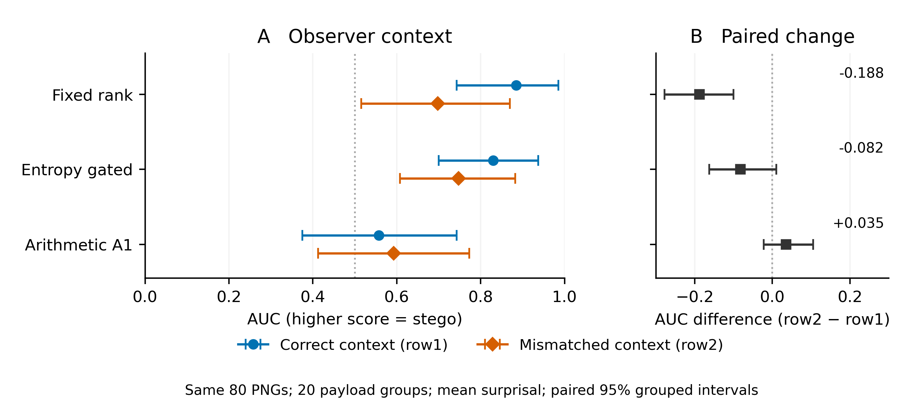

# PNG context-mismatch observer extension

**Complete: 80/80 saved PNGs scored; no failures or exclusions.** The observer's primary fixed-rank AUC decreased under the previously frozen row2, but mean-surprisal scores remained informative for fixed and gated carriers in this sample. This is a bounded extension of accepted V2 evidence, not a new carrier-generation study.



[Figure PDF](context_auc.pdf) · [SVG](context_auc.svg) · [PNG](context_auc.png) · [Captions](captions.md)  
[Full table: Markdown](comparison.md) · [CSV](comparison.csv) · [LaTeX](comparison.tex)

## Primary result

| Method | Correct row1 AUC | Mismatched row2 AUC [95% CI] | Paired change [95% CI] |
|---|---:|---|---|
| Fixed rank | 0.8850 | 0.6975 [0.5150, 0.8700] | -0.1875 [-0.2775, -0.1000] |
| Entropy gated | 0.8300 | 0.7475 [0.6074, 0.8825] | -0.0825 [-0.1625, 0.0100] |
| Arithmetic A1 | 0.5575 | 0.5925 [0.4124, 0.7725] | +0.0350 [-0.0225, 0.1050] |

Every cell uses 20 payload groups and 20 unique controls. The same controls are shared across methods; both observer conditions are repeated measurements of the same PNGs. Fixed rank has a resolved paired reduction; gated and A1 change intervals include zero. The mismatched primary fixed/gated AUC intervals remain above 0.5; A1 remains inconclusive. The secondary rank-score table qualifies this conclusion: its fixed-rank row2 interval includes chance.

This tests **one context mismatch with the exact model and scoring procedure known**. It is not fully blind detection, model-independent detection, resistance to arbitrary observers or cryptographic secrecy. No score direction or threshold was selected using these outcomes.

## What was executed and preserved

The observer scored 60 existing V2 stego PNGs (20 per method) and their 20 ordinary controls under row2, once each, plus three preselected development score-reproduction jobs under original row1. No V2 row1 rescoring, carrier regeneration, encryption, payload decoding or new data occurred. All 83 jobs used the unchanged CUDA graph PixelCNN++ backend on the pinned RTX 5000 Ada. Each scored PNG contributed all 2,976 delivered RGB values and 992 scoring forwards. Existing graph warmup/capture forwards are additional setup work and are included in the charge.

The observer input directory contains only PNG, common profile and conditioning-row files. Labels, source/control associations and accepted comparison scores stay outside the observer. No key, source payload, packet, sender cache or reference answer is an observer input. Row identities and provenance are recorded without new raw conditioning disclosure.

Starting checkout: `cdff18c30a0492f242921d72fb369ef78a6a7f38`, the publication-package addition after reviewed benchmark `5e08a8b`. New execution identities are separate from historical ones. All **11,269 protected historical files** remained byte-identical.

## Evidence index

- [Frozen 80-artifact manifest, row provenance, order and statistical rules](manifest.json)
- [Execution/source/configuration freeze](execution_freeze.json), [compact provenance and runtime identity](provenance.json)
- [Development score reproduction](validation.json): exact retained scores on fixed, A1 and ordinary PNGs; both available exact probability/order/eligibility stream digests also matched
- [Focused non-model checks](focused_verification.json)
- [Measured full-batch preflight](preflight_forecast.json)
- [Per-artifact machine-readable results](results.jsonl), [coverage](coverage.json), [analysis](analysis.json)
- [Observer reports](reports/), [immutable terminal records](terminals/), [GPU job evidence](gpu_jobs.json)
- [Accounting](accounting.json), [preservation](preservation.json), [public verification](public_verification.json), [final disclosure/integrity check](final_integrity.json)
- [Detailed notes and manuscript-ready Results paragraph](../../notes/png_context_detection.md#manuscript-ready-results-paragraph)
- Accepted sources: [V2](../v2_review/README.md), [GPU benchmark](../gpu_performance_review/README.md), [V1 qualification](../v1_qualification_review/README.md), [publication results](../publication_results/README.md). These packages were not overwritten.

The primary and secondary scores are the unchanged whole-carrier mean eligible-distribution surprisal and mean log2 rank. Higher always means stego. The 2,000 accepted-style PCG64 bootstrap draws (seed 2026090902) resample the 20 groups within frozen length strata and jointly carry both contexts, all methods and shared controls. Paired changes are calculated within each draw. The table CSV stores unrounded values.

## GPU accounting

New usage: **1439.645 seconds** (0.3999 GPU-hours): 51.871 development-validation seconds plus 1387.775 row2-scoring seconds. Remaining extension allowance: **5760.355 seconds**.

Cumulative project usage: **88975.068 seconds** (24.7153 hours); **55024.932 seconds** remain below the 144,000-second ceiling. There is no remaining model work in this extension. Loading, graph setup, occupied CPU bookkeeping, scoring and teardown are charged; nested CUDA-event/phase timings are not added again. Unused allowances are not charges or new execution authorization.

## Reproduction and verification

On the original host, replace `python` with `/home/meow/Documents/repos/llm-rankcloak/.venv/bin/python`.

Public saved-evidence verification, with no model, keys, private runs or GPU access:

```bash
python -B scripts/analyze_png_context_detection.py --verify
```

CPU analysis/export and the focused observer checks:

```bash
python -B scripts/analyze_png_context_detection.py
python -B -m unittest tests.test_png_observer -v
```

The full export command requires the retained local execution ledgers as well as saved reports and accepted V2 evidence; do not run it on a public-only checkout. Use `--verify` there: it recomputes and checks the paired AUC analysis from public scores and reads the saved accounting/job exports without accessing private ledgers. No model inference is involved in either CPU command. The figure was inspected at publication size; the LaTeX table was compiled and inspected at manuscript width without layout warnings. No broad CPU portability campaign was run.

Original budgeted GPU commands (already complete; continuation skips terminal work):

```bash
python -B -m imagecalgacus.png_context_detection prepare
python -B -m imagecalgacus.png_context_detection run
```

These require the pinned local CUDA environment/checkpoint and existing row files. The manifest order, per-job commands and identities are retained in the freeze and GPU records. The low-level likelihood observer accepts `--carrier --profile --context --report`; it must run through the existing accounting wrapper, never as an uncharged model process. Fresh GPU reproduction is different from public verification and consumes the same capped allowance. Do not delete terminal records or reset a ledger to create new attempts.

No private keys, prepared packets, model weights, raw private audit traces or new conditioning-row files are included. Attribution remains in [THIRD_PARTY.md](../../THIRD_PARTY.md). No extra experiments, commits, pushes, submissions or publication were performed.
