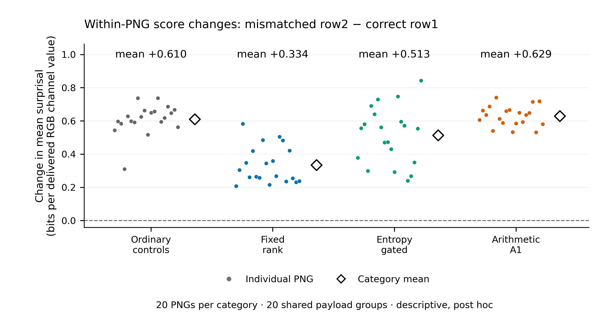

<!-- Generated by scripts/build_png_context_addendum.py -->
# PNG conditioning mismatch: manuscript-ready results component

This is a compact integration component, not a complete manuscript. Figure/table numbers below extend the existing publication index provisionally; stable labels are supplied for later typesetting. [Results index](README.md).

## Methods

The context-detection experiment evaluated the same 60 held-out stego PNGs (20 per method) and 20 ordinary PNG controls with an observer knowing the exact PixelCNN++ model and scoring procedure. Correct-context row1 scores were retained from V2; the mismatched observer used the previously frozen development row2. Row1 was the first row of a generated image; row2 comprised random RGB values, frozen before this comparison. Each score is the mean eligible-distribution surprisal over all 2,976 delivered RGB channel values; mean log2 rank is the retained secondary score. Higher scores indicate stego throughout. The accepted 95% AUC/change intervals used 2,000 length-stratified resamples of the 20 payload groups, jointly preserving both observer conditions, methods and shared controls. Each ordinary control is counted once, not as three independent method-specific controls.

For the present descriptive post hoc addition, we subtracted each artifact's correct-context score from its mismatched-context score. We report category means and medians and the mean fixed-minus-control score gap, calculated within the original payload/control groups. We add no tests, confidence intervals, fitted thresholds, inference passes or transmissions.

## Results

The primary fixed-rank AUC decreased from 0.8850 to 0.6975, with paired change -0.1875 and accepted 95% interval [-0.2775, -0.1000] ([Figure 5](#fig-png-context-auc)). Gated AUC changed from 0.8300 to 0.7475 (-0.0825, [-0.1625, 0.0100]); arithmetic A1 changed from 0.5575 to 0.5925 (+0.0350, [-0.0225, 0.1050]). Gated and A1 changes remain uncertain. Under mismatch the fixed-rank primary interval [0.5150, 0.8700] only narrowly excludes 0.5; its secondary rank-score interval [0.4725, 0.8475] includes 0.5 ([Table S2](#tab-png-context-scores)). A clear change for one method and an uncertain change for another do not by themselves establish a difference between the methods' sensitivities.

Across 20 artifacts per category, mean score changes were +0.610 for ordinary controls, +0.334 for fixed rank, +0.513 for gating and +0.629 for A1, in bits per delivered RGB channel value ([Figure S3](#fig-png-score-shifts); [descriptive summary](../../artifacts/png_context_detection_addendum/score_shift_summary.md)). The paired mean fixed-minus-control gap narrowed from 0.507624 to 0.231119 (change -0.276505). Larger mean score increases for controls than fixed-rank carriers are consistent with this narrowed gap. These descriptive means do not prove why AUC changed: AUC depends on the full score rankings.

## Limitations

This is one specified context mismatch with one known model. Because row1 came from a generated image and row2 from random RGB values, it does not separate context correctness from every difference in row statistics. The observations are repeated measurements of existing carriers in 20 shared payload groups, not additional independent transmissions. The post hoc mean shifts do not establish an independently confirmed mechanism or a between-method sensitivity difference. The accepted AUC intervals are exploratory; neither a near-chance AUC nor context dependence establishes cryptographic secrecy, broad resistance to detection or resistance to fully blind/model-independent observers.

## Main Results figure

### Figure 5: Correct versus mismatched PNG observer context

[PDF](../../artifacts/png_context_detection_review/context_auc.pdf) · [SVG](../../artifacts/png_context_detection_review/context_auc.svg). Stable manuscript label: `fig:png-context-auc`.

**Caption.** Accepted primary mean-surprisal AUCs under correct row1 and mismatched row2 (A), with paired changes, row2 minus row1 (B). The same 60 stego PNGs and 20 shared ordinary controls are used in both conditions. Whiskers are the original grouped 95% intervals from 2,000 length-stratified payload-group draws, preserving both conditions, all methods and shared controls. The observer knows the exact model and scoring procedure. Higher score always means stego; no AUC orientation or classification threshold is selected here. The dotted lines mark 0.5 AUC and zero change, not fitted thresholds. This existing figure is reused unchanged; its findings do not establish security.

## Supplementary material

### Figure S3: Descriptive score shifts

[PDF](../../artifacts/png_context_detection_addendum/score_shifts.pdf) · [SVG](../../artifacts/png_context_detection_addendum/score_shifts.svg). Stable manuscript label: `fig:png-score-shifts`.

**Figure S3 (provisional). Descriptive within-PNG score changes under a mismatched conditioning row.**
Each point is the same artifact's row2 minus row1 whole-carrier mean-surprisal score, in bits per delivered RGB channel value—not a change in AUC. All 80 points (20 ordinary controls, 20 fixed-rank, 20 gated and 20 arithmetic A1 PNGs) come from retained observations in the context-detection experiment. Categories share the same 20 payload groups; each group's ordinary control is counted once and shared across methods. Horizontal offsets follow frozen group order and serve only to separate points. Open black diamonds and annotations show category means; the dashed line marks zero score change. Row2 is the previously frozen random-RGB conditioning row, whereas row1 came from a generated image. This descriptive, post hoc analysis adds no confidence intervals, tests or observations. Mean changes illustrate score movement; AUC depends on the full score rankings. The plot neither establishes security nor isolates a causal mechanism for the AUC changes.

### Table S2: Full primary and secondary context-detection comparison

[Accepted Markdown table](../../artifacts/png_context_detection_review/comparison.md) · [LaTeX](../../artifacts/png_context_detection_review/comparison.tex) · [unrounded CSV](../../artifacts/png_context_detection_review/comparison.csv). Stable manuscript label: `tab:png-context-scores`.

**Caption.** Original correct/mismatched AUCs, grouped intervals and paired changes for whole-carrier mean surprisal and mean log2 rank. Each cell has 20 scorable stego PNGs and 20 unique matched controls; the same controls are shared across methods and conditions. These are repeated score measurements, not new recovery observations. Existing score orientation, group resampling and numerical results are unchanged.

## Reproduction and sources

`python -B scripts/build_png_context_addendum.py` reads only public retained evidence and uses the existing NumPy/Matplotlib plotting stack. No weights, raw contexts, keys, packets or execution ledgers are required. [Addendum/provenance](../../artifacts/png_context_detection_addendum/README.md) · [Accepted detection evidence](../../artifacts/png_context_detection_review/README.md) · [Existing publication index](../../artifacts/publication_results/README.md). New GPU usage for this reporting addition: **0 seconds**.
